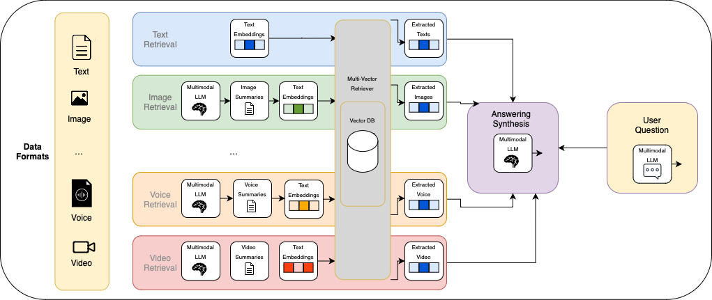

# [Cognitive AI for the Future: Multimodal Models and RAG in Vision Language Applications, from Training to Deployment](https://github.com/zhuo-yoyowz/cvpr-2025)

## What is Multimodal RAG ?

Multimodal RAG is a system that lets users query and generate responses using data from multiple formats—not just text, but also images, video, and audio. It retrieves relevant content across these modalities and uses that context to produce more informed, grounded outputs.

This approach extends traditional RAG by handling multiple data types during both retrieval and generation, enabling applications like visual question answering, multimodal search, and context-aware assistants.

## Architecture

This is just for multimodal RAG that all report to a Vector database. If not reporting to one Vector database then each data format will store in its own data store.

## Tools Used

1. OpenVINO
2. LangChain
3. LlamaIndex
4. Model Context Protocol
5. BridgeTower
6. UMAP
7. Optimum Habana
8. LoRA
9. PEFT
10. FastMCP
11. NNCF
